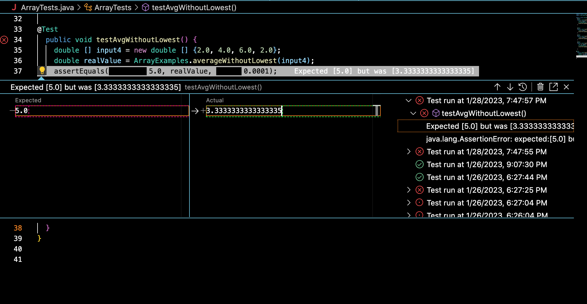
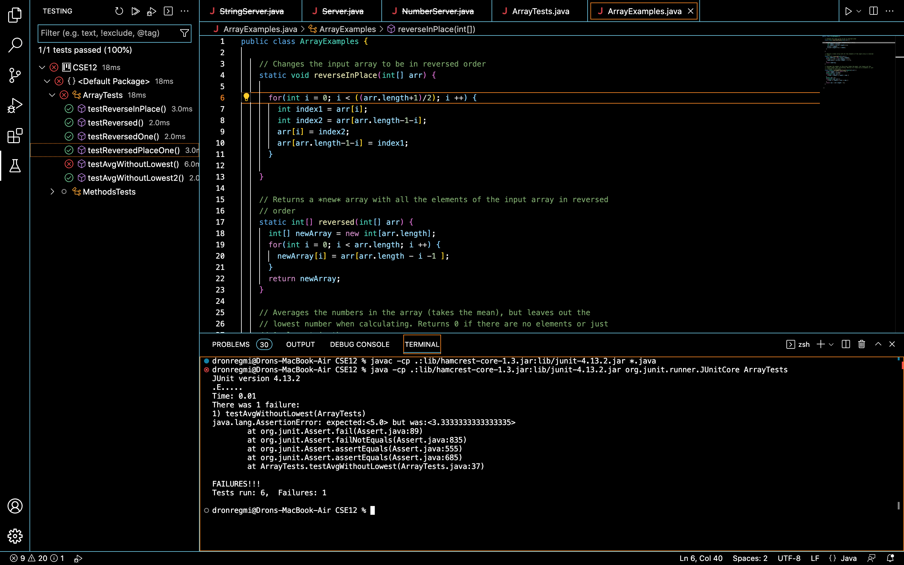

__Part 1__ : 
---

This is an image of my `StringServer.java` file


Here is the code written out in a code block:
```
import java.io.IOException;
import java.net.URI;


class Handler implements URLHandler{
    String webPage = "";
    public String handleRequest(URI url) {
        if (url.getPath().equals("/add-message")) {
            String[] parameters = url.getQuery().split("=");
            webPage += ("\n " + parameters[1]);
            return webPage;
        }
        else {
            return "404 Not Found!"; 
        }
        
}
}
class StringServer {
    public static void main(String[] args) throws IOException {
        if(args.length == 0){
            System.out.println("Missing port number! Try any number between 1024 to 49151");
            return;
        }

        int port = Integer.parseInt(args[0]);

        Server.start(port, new Handler());
    }
}
```
Here are two examples of `/add-message` being used:


In this screenshot, the method that is called is `handleRequest(URI url)`. Within this user defined method, other methods such as `.getPath()`, `.equals()`, `.split()`, and `.getQuery()`. The relevant arguments of these methods include the actual URI in `.handleRequest()` , the `"/add-message"` 
inside `.equals()` and the equals sign in `.split()`. The relevant fields in this case would be the value of `webpage`, which is initialized to `""`, and this changes to "Hello, how are you?" after the request is made.


In this screenshot, the same methods are called as in the aforementioned request. The only difference is in the relevant field, which changes from "Hello, how are you?" to "Hello, how are you" and "I'm doing great! How about yourself?" on the new line.


__Part 2__ : 
---

The bug I am choosing for Part 2 is the one inside the `averageWithoutLowest(double[] arr)` method in the `ArrayExamples.java` file

Here is an example of a failure inducing input for the current code:

```
  @Test
  public void testAvgWithoutLowest() {
    double [] input4 = new double [] {2.0, 4.0, 6.0, 2.0};
    double realValue = ArrayExamples.averageWithoutLowest(input4);
    assertEquals(5.0, realValue, 0.0001);
  }
  
  ```
  This test, when ran, expects 5.0 to be returned. However, the actual value returned is 3.33333. This is because 6.0 and 4.0 add up to 10.0, and that value is divided by the length - 1, which returns 3.33333. Here is what shows up in VSCode after running the test:
  
  
  
  Here is an input that doesn't produce a failure:
  
  ```
  @Test
  public void testAvgWithoutLowest2() {
    double [] input5 = new double [] {1.0, 2.0, 3.0, 4.0};
    double realValue = ArrayExamples.averageWithoutLowest(input5);
    assertEquals(3.0, realValue, 0.0001);
  }
  
  ```
  
The method (before fixing it) looks like this:

```
  static double averageWithoutLowest(double[] arr) {
    if(arr.length < 2) { return 0.0; }
    double lowest = arr[0];
    for(double num: arr) {
      if(num < lowest) { lowest = num; }
    }
    double sum = 0;
    for(double num: arr) {
      if(num != lowest) { sum += num; }
    }
    return sum / (arr.length - 1);
  }
  
  ```
The issue with this particular program is that if you have multiple occurances of the lowest number, you have to divide the sum by the array length minus the number of times `lowest` appears in the array. Here are what the symptoms look like for the first test:

 
 
 

 
The second input doesn't produce an incorrect output, so there is no failure message in the terminal for this second test. The only error in the terminal is from the first input.
 
 

  
