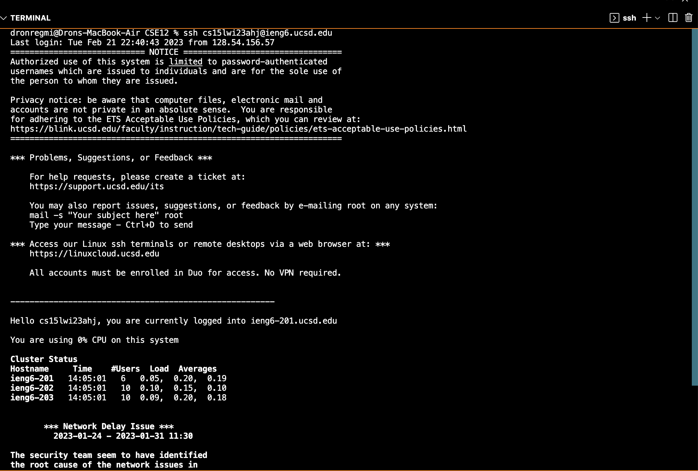
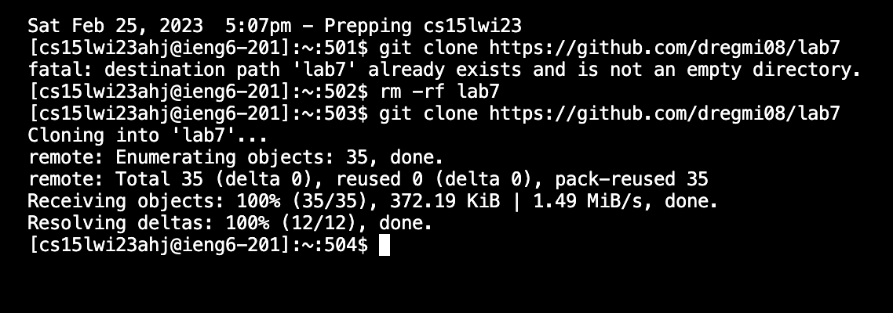
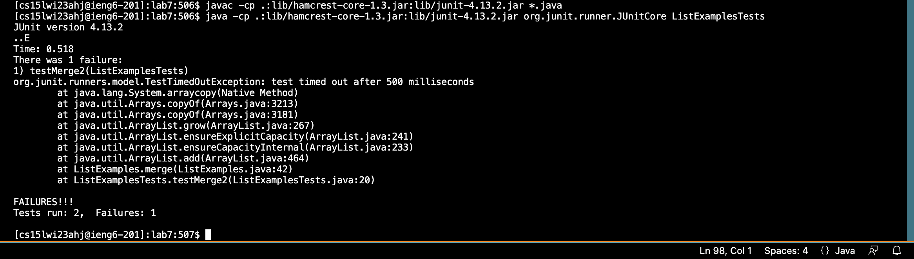
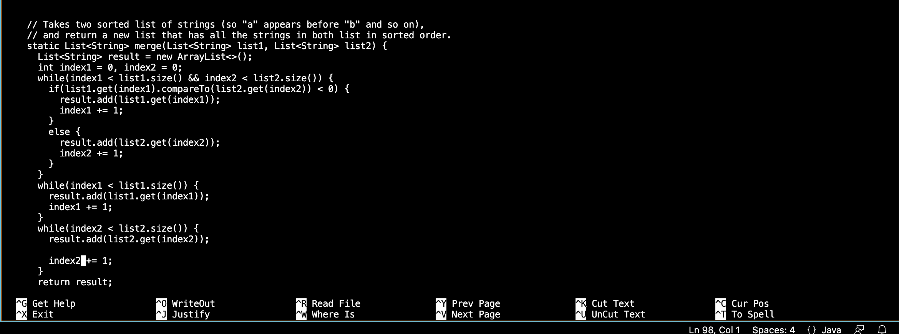
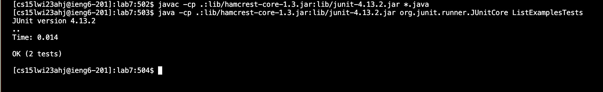

Lab Report 4
---
This page contains information pertaining to running Steps 4-9 in Lab 7 while optimizing time.

Step 4: Logging into `ieng6`
---

For this step, I just typed out my username using `ssh`. Even though I typed out this command fully, I did not have to type out my password to log in, since I created a public `ssh` key for my account during lab. By doing this, I saved time that I would normally spend typing in my password.

Step 5: Cloning my fork of the repository.
---

For this step, I knew that I had typed out `git clone https://github.com/dregmi08/lab7` when I was running these commands during lab. So, I searched for it by repeatedly pressing the `up` key on my laptop. When first searching for the command, I pressed `up` nine times. 

Keys Pressed initially: `<up><up><up><up><up><up><up><up><up><enter>`
  
 However, since I had followed these steps before, the lab7 repository was already clone, so I used the command `rm -rf lab7` to first delete the directory and then searched for the `git clone` command again.
  
  
  
  Keys Pressed second time:
    -Searching for rm -rf: `<up><up><up><up><up><up><up><up><up><up><up><enter>`
    -Searching for `git clone` a second time : `<up><up><enter>`
  
  
  
Step 6: Compiling and Running the files
---
   
  To access the `javac -cp .:lib/hamcrest-core-1.3.jar:lib/junit-4.13.2.jar *.java` command, I had to press the `up` key eleven times. To access the 
  `java -cp .:lib/hamcrest-core-1.3.jar:lib/junit-4.13.2.jar org.junit.runner.JUnitCore ListExamplesTests` command, I also had to go eleven up. 
  
  Searching for the compile and run commands: `<up><up><up><up><up><up><up><up><up><up><up><enter>`
  
  

Step 7: Making the changes/editing the files.
---
  
  To access the `nano ListElements.java` command, I pressed the `up` key eleven times.
  
  Searching for the nano command: `<up><up><up><up><up><up><up><up><up><up><up><enter>`
  
  After, I pressed `control` o and I made the following change:
  
  
  
  Then, I pressed `enter` and `control x`
  

  
Step 8: Running the Tests to show they succeed
---

  
  

  To access the `javac -cp .:lib/hamcrest-core-1.3.jar:lib/junit-4.13.2.jar *.java` command, I had to press the `up` key two times. To access the 
  `java -cp .:lib/hamcrest-core-1.3.jar:lib/junit-4.13.2.jar org.junit.runner.JUnitCore ListExamplesTests` command, I also had to go two up. 
  
  Keys pressed to compile and run: `<up><up><enter>`
  
 
Step 9:
---
