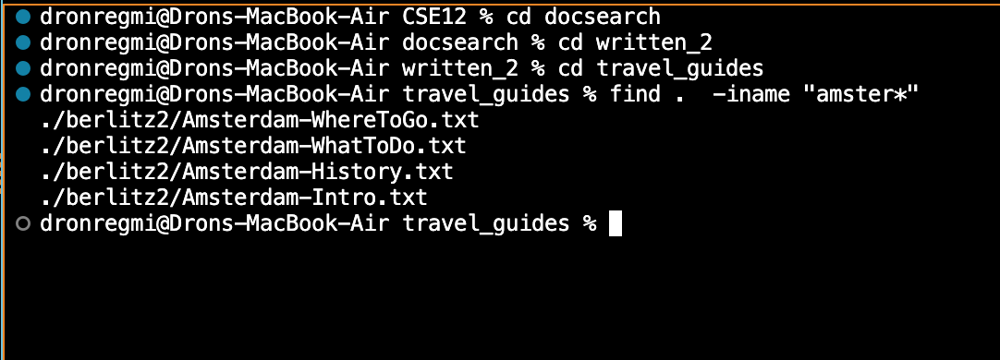
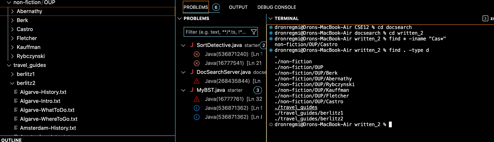
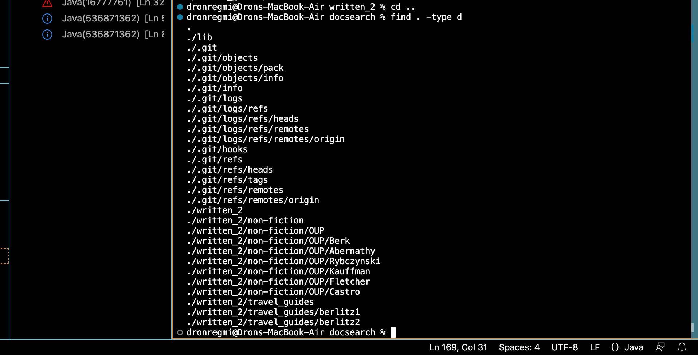
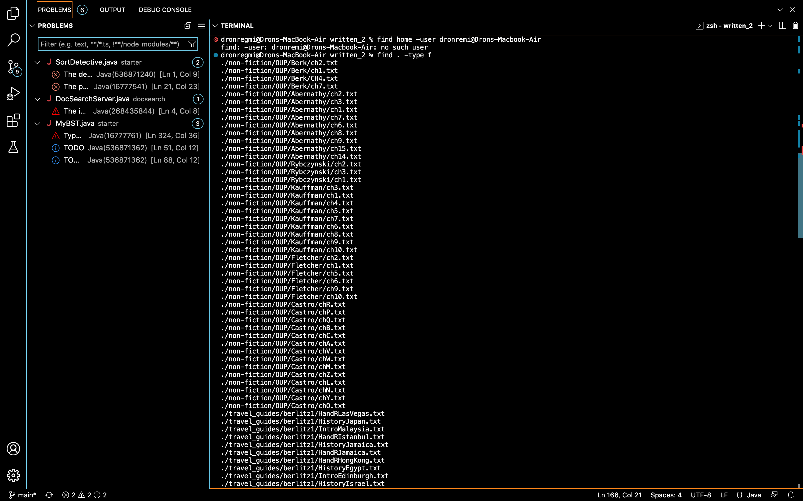
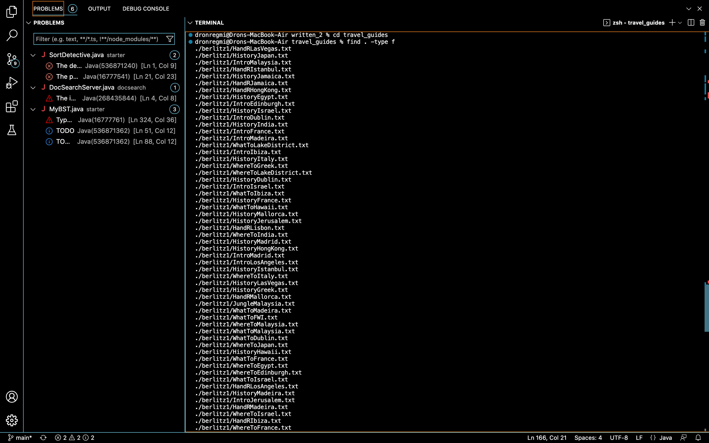

__Lab Report 5__
---
One particular lab activity that I would like to revisit would be the exploration of the different ways in which you can use `find` and `grep`. In my 
own lab report 3, I explored 5 different way in which `grep` could be used, including commands such as `grep -v`, `grep "" file_name`, and `grep -c`.
For this report, I am going to explore 5 ways in which you can use the `find` command.

***Some of the terminal output is ommitted because of how long it is***

---

__First use:__  `find -iname` or searching by approximate name

Example #1:



Here is the command and its output in a code block:

```
dronregmi@Drons-MacBook-Air CSE12 % cd docsearch            
dronregmi@Drons-MacBook-Air docsearch % cd written_2            
dronregmi@Drons-MacBook-Air written_2 % cd travel_guides        
dronregmi@Drons-MacBook-Air travel_guides % find .  -iname "amster*"
./berlitz2/Amsterdam-WhereToGo.txt
./berlitz2/Amsterdam-WhatToDo.txt
./berlitz2/Amsterdam-History.txt
./berlitz2/Amsterdam-Intro.txt
```

Example #2 :


Here is the command and its output in a code block:
```
dronregmi@Drons-MacBook-Air CSE12 % cd docsearch            
dronregmi@Drons-MacBook-Air docsearch % cd written_2 
dronregmi@Drons-MacBook-Air written_2 % find . -iname "cas*"
./non-fiction/OUP/Castro
```

The purpose of this command is to find specific files/directories without you (the user) having to remember the exact filename. This `find` command is
also case insensitive, meaning that you can not only find files/directories without knowing the whole filename (you can use the asterisk to find
files that contain that specific string) but you don't have to remember if the file name contains a capital letter. This is very useful if you can only 
remember part of a filename but can't remember the exact name. I cloned the same repository containing the files/directories we used in lab 3, and I 
switched into `docsearch`, `written_2`, and then `travel_guides` for my first example. I then typed `find .  -iname "amster*"` and got the respective 
directory. For my second example, I used the command find . -iname "cas*" and got the respective file. My source for this command is 
[here](https://linuxhandbook.com/find-command-examples/).

---

__Second Use:__ `find -type d` or listing directories

Example #1:



Here is the command and its output in a code block:
```
dronregmi@Drons-MacBook-Air written_2 % find . -type d          
.
./non-fiction
./non-fiction/OUP
./non-fiction/OUP/Berk
./non-fiction/OUP/Abernathy
./non-fiction/OUP/Rybczynski
./non-fiction/OUP/Kauffman
./non-fiction/OUP/Fletcher
./non-fiction/OUP/Castro
./travel_guides
./travel_guides/berlitz1
./travel_guides/berlitz2
```

Example #2:



Here is the command and its output in a code block:

```
dronregmi@Drons-MacBook-Air written_2 % cd ..               
dronregmi@Drons-MacBook-Air docsearch % find . -type d
.
./lib
./.git
./.git/objects
./.git/objects/pack
./.git/objects/info
./.git/info
./.git/logs
./.git/logs/refs
./.git/logs/refs/heads
./.git/logs/refs/remotes
./.git/logs/refs/remotes/origin
./.git/hooks
./.git/refs
./.git/refs/heads
./.git/refs/tags
./.git/refs/remotes
./.git/refs/remotes/origin
./written_2
./written_2/non-fiction
./written_2/non-fiction/OUP
./written_2/non-fiction/OUP/Berk
./written_2/non-fiction/OUP/Abernathy
./written_2/non-fiction/OUP/Rybczynski
./written_2/non-fiction/OUP/Kauffman
./written_2/non-fiction/OUP/Fletcher
./written_2/non-fiction/OUP/Castro
./written_2/travel_guides
./written_2/travel_guides/berlitz1
./written_2/travel_guides/berlitz2
```

The purpose of this command is to find every directory in the current directory and its subdirectories. This includes the directory you are in when you 
call this command, as "." is also listed. This `find` command is useful if you don't want to find every single file within the directories. If you just 
want the names of the directories themselves, you can have them listed for you. For my first example, I called `find . -type d` from the `written_2` 
directory, and the respective output was all the directories and subdirectories of `written_2`. For my second example, I called `cd ..` to go into the 
`docsearch` directory and called the same command. This time, I was given more directories, since `docsearch` contains more directories than just 
`written_2`. My source for finding this is [here](https://linuxhandbook.com/find-command-examples/).

---

__Third Use:__ `find . -type f -empty` or finding all empty files in the current directory and its subdirectories

Example #1 :


Here is the command and its output in a code block:

```
dronregmi@Drons-MacBook-Air docsearch % cd written_2 
dronregmi@Drons-MacBook-Air written_2 % find . -type f -empty   
./foundfile.txt
./founfile.txt
```

Example #2 :


Here is the command and its output in a code block:

```
dronregmi@Drons-MacBook-Air written_2 % cd travel_guides 
dronregmi@Drons-MacBook-Air travel_guides % find . -type f -empty
```

The purpose of this command is to find all empty files in the current directory and its subdirectories. This `find` command is useful if you don't want to 
find every single empty file within the directories and delete them, therefore clearing up any clutter in your workspace. In my first example, I called 
`find . -type f -empty` from the `written_2` directory . I had previously created two empty files within this directory, just for the purposes of this
demonstration. I named these files `foundfile.txt` and `founfile.txt`, and when calling find . -type f -empty  , these files were listed. For my second 
example, I started from the `travel_guides` directory and used the command. Since this file does not contain any files that are empty, nothing was listed.
My source for finding this command is [here](https://linuxhandbook.com/find-command-examples/)

---

__Fourth Use:__ `find -size +_M` or finding files larger than _ amount of megabytes

Example #1:


Here is the command and its output in a code block:

```
dronregmi@Drons-MacBook-Air travel_guides % find . -size +2M 
dronregmi@Drons-MacBook-Air travel_guides % 
```

Example #2:


Here is the command and its output in a code block:

```
dronregmi@Drons-MacBook-Air travel_guides % cd ..
dronregmi@Drons-MacBook-Air written_2 % cd non-fiction 
dronregmi@Drons-MacBook-Air non-fiction % cd OUP 
dronregmi@Drons-MacBook-Air OUP % find . -size +1M
```

The purpose of this command is to find all files that are greater than a specific inputted size. This `find` command is useful if you want to find the 
files that take up a lot of storage and delete them if you don't need them anymore. In my first example, I called `find . -size +2M` from the 
`travel_guides` directory, and not a single file way listed, meaning that no files in that directory exceed the size of 1 megabyte. For my second example,
I switched into the `OUP` directory with a few commands and I used the command `find . -size +1M`. Again, not files appeared to be listed, meaning that no 
individual file is greater than one megabyte. Source: I used ChatGPT to list some examples of `find` commands, you can find my request 
[here](https://chat.openai.com/chat). 

---

__Fifth Use:__ `find . -type f` or finding non-directory files



Example #1 : 


Here is the command and its output in a code block:

```
dronregmi@Drons-MacBook-Air written_2 % find . -type f
./non-fiction/OUP/Berk/ch2.txt
./non-fiction/OUP/Berk/ch1.txt
./non-fiction/OUP/Berk/CH4.txt
./non-fiction/OUP/Berk/ch7.txt
./non-fiction/OUP/Abernathy/ch2.txt
./non-fiction/OUP/Abernathy/ch3.txt
./non-fiction/OUP/Abernathy/ch1.txt
./non-fiction/OUP/Abernathy/ch7.txt
./non-fiction/OUP/Abernathy/ch6.txt
./non-fiction/OUP/Abernathy/ch8.txt
./non-fiction/OUP/Abernathy/ch9.txt
./non-fiction/OUP/Abernathy/ch15.txt
./non-fiction/OUP/Abernathy/ch14.txt
./non-fiction/OUP/Rybczynski/ch2.txt
./non-fiction/OUP/Rybczynski/ch3.txt
./non-fiction/OUP/Rybczynski/ch1.txt
./non-fiction/OUP/Kauffman/ch3.txt
./non-fiction/OUP/Kauffman/ch1.txt
./non-fiction/OUP/Kauffman/ch4.txt
./non-fiction/OUP/Kauffman/ch5.txt
./non-fiction/OUP/Kauffman/ch7.txt
./non-fiction/OUP/Kauffman/ch6.txt
./non-fiction/OUP/Kauffman/ch8.txt
./non-fiction/OUP/Kauffman/ch9.txt
./non-fiction/OUP/Kauffman/ch10.txt
./non-fiction/OUP/Fletcher/ch2.txt
./non-fiction/OUP/Fletcher/ch1.txt
./non-fiction/OUP/Fletcher/ch5.txt
./non-fiction/OUP/Fletcher/ch6.txt
./non-fiction/OUP/Fletcher/ch9.txt
./non-fiction/OUP/Fletcher/ch10.txt
./non-fiction/OUP/Castro/chR.txt
./non-fiction/OUP/Castro/chP.txt
./non-fiction/OUP/Castro/chQ.txt
./non-fiction/OUP/Castro/chB.txt
./non-fiction/OUP/Castro/chC.txt
./non-fiction/OUP/Castro/chA.txt
./non-fiction/OUP/Castro/chV.txt

```

***Some of the terminal output is ommitted because of how long it is***

Example #2:




Here is the command and its output in a code block:

```
dronregmi@Drons-MacBook-Air written_2 % cd travel_guides
dronregmi@Drons-MacBook-Air travel_guides % find . -type f  
./berlitz1/HandRLasVegas.txt
./berlitz1/HistoryJapan.txt
./berlitz1/IntroMalaysia.txt
./berlitz1/HandRIstanbul.txt
./berlitz1/HistoryJamaica.txt
./berlitz1/HandRJamaica.txt
./berlitz1/HandRHongKong.txt
./berlitz1/HistoryEgypt.txt
./berlitz1/IntroEdinburgh.txt
./berlitz1/HistoryIsrael.txt
./berlitz1/IntroDublin.txt
./berlitz1/HistoryIndia.txt
./berlitz1/IntroFrance.txt
./berlitz1/IntroMadeira.txt
./berlitz1/WhatToLakeDistrict.txt
./berlitz1/IntroIbiza.txt
./berlitz1/HistoryItaly.txt
./berlitz1/WhereToGreek.txt
./berlitz1/WhereToLakeDistrict.txt
./berlitz1/HistoryDublin.txt
./berlitz1/IntroIsrael.txt
./berlitz1/WhatToIbiza.txt
./berlitz1/HistoryFrance.txt
./berlitz1/WhatToHawaii.txt
./berlitz1/HistoryMallorca.txt
./berlitz1/HistoryJerusalem.txt
./berlitz1/HandRLisbon.txt
./berlitz1/WhereToIndia.txt
./berlitz1/HistoryMadrid.txt
./berlitz1/HistoryHongKong.txt
./berlitz1/IntroMadrid.txt
./berlitz1/IntroLosAngeles.txt
./berlitz1/HistoryIstanbul.txt
./berlitz1/WhereToItaly.txt
```
***Some of the terminal output is ommitted because of how long it is***

The purpose of this command is to find all files in a given directory that are not subdirectories. The `find`command works by recursively finding every 
single file, directory, and subdirectory in your current directory. If you wanted to find files, you would have to take a few steps, using commands such 
as `grep` and `cat`. Using this command gives you an easy way to find just the files in your directory, making this a very practical tool. For my first 
example, I used the command `find . -type f` while in the `written_2` directory. The output was every single text file, and the `non_fitcion` and `OUP` 
directories were not listed, the only appearance of these words is in the path to all the text files, which is the expected result. For my second example 
I used some commands to change into the `travel_guides` directory and used the `find . -type f` command. Again, none of the subdirectories were listed 
themselves, but only appeared in the paths to the text files. Source: I used ChatGPT to list some examples of `find` commands, you can find my request 
[here](https://chat.openai.com/chat).

--- 

__Conclusion__ : Learning about terminal commands and finding different ways in which you can use them can save you a lot of time in the future by 
providing you with usefuland practical ways in which you want to accomplish certain things. Instead of searching for every directory for a file, you
can just use the `find` command. Instead of wasting time just to find text files, you can use `find . -type f` to accomplish this task. Many of these
commands are useful tools that I will carry with me as I continue to learn more about the vast field of computer science.
