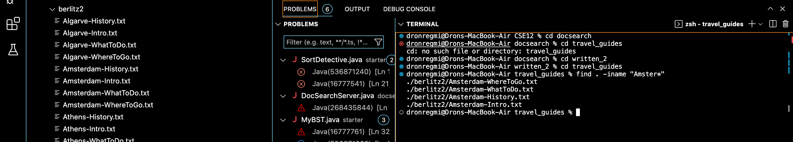
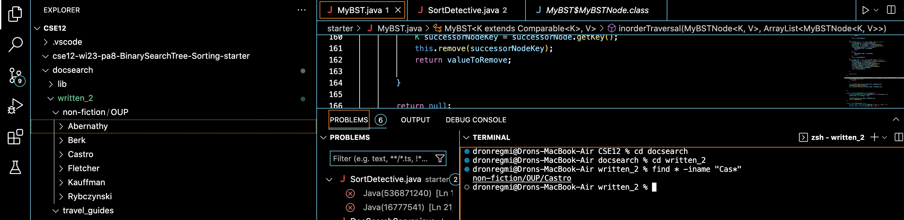

__Lab Report 5__
---
One particular lab activity that I would like to revisit would be the exploration of the different ways in which you can use `find` and `grep`. In my 
own lab report 3, I explored 5 different way in which `grep` could be used, including commands such as `grep -v`, `grep "" file_name`, and `grep -c`.
For this report, I am going to explore 5 ways in which you can use the `find` command.

***Some of the terminal output is ommitted because of how long it is***

__First use:__  `find -iname` or searching by approximate name

Example #1:



This is what the commands are in a code block :

```
dronregmi@Drons-MacBook-Air CSE12 % cd docsearch            
dronregmi@Drons-MacBook-Air docsearch % cd written_2            
dronregmi@Drons-MacBook-Air written_2 % cd travel_guides        
dronregmi@Drons-MacBook-Air travel_guides % find .  -iname "Amster*"
./berlitz2/Amsterdam-WhereToGo.txt
./berlitz2/Amsterdam-WhatToDo.txt
./berlitz2/Amsterdam-History.txt
./berlitz2/Amsterdam-Intro.txt
```

Example #2 :



This is what the commands are in a code :

```
dronregmi@Drons-MacBook-Air CSE12 % cd docsearch            
dronregmi@Drons-MacBook-Air docsearch % cd written_2 
dronregmi@Drons-MacBook-Air written_2 % find . -iname "Cas*"
./non-fiction/OUP/Castro
```

__Second Use:__ `find -type d` or listing directories

Example #1:


Here is the command and its output in a code block:
```
dronregmi@Drons-MacBook-Air written_2 % find . -type d          
.
./non-fiction
./non-fiction/OUP
./non-fiction/OUP/Berk
./non-fiction/OUP/Abernathy
./non-fiction/OUP/Rybczynski
./non-fiction/OUP/Kauffman
./non-fiction/OUP/Fletcher
./non-fiction/OUP/Castro
./travel_guides
./travel_guides/berlitz1
./travel_guides/berlitz2
```

Example #2:


__Third Use:__ `find . -type f -empty` or finding all empty files in the current directory and its subdirectories

Example #1 :


Example #2 :


__Fourth Use:__ `


