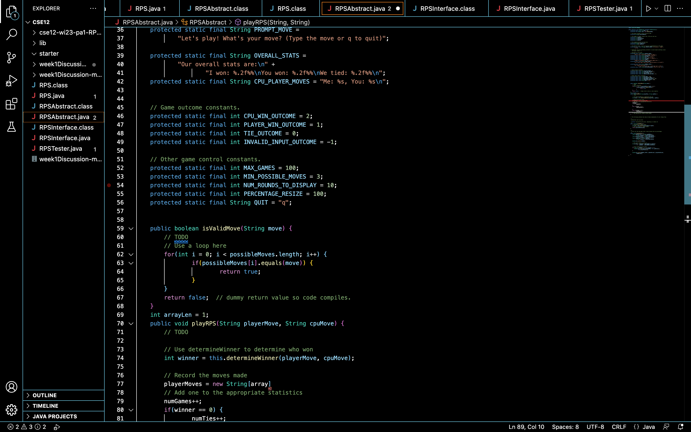

This blog post contains instructions on how to connect to the CSE basement and run commands in the terminal.

__Step 1__ : Looking up your CSE 15L account 
---

For this step, I went to the following link: https://sdacs.ucsd.edu/~icc/index.php
Instead of opting to change my password to something else, I used my canvas log in password since the password met the strength requirement. 

__Step 2__ : Installing VSCode
---
In order to login to your course-specific account using ieng6, you need to download VSCode and use the command line. For this particular step, I did 
not need to install the IDE since I had done that last quarter for CSE 11.

__Step 3__ : Opening the Terminal
---
Since I am using a Macbook, I did not need to install git for Windows. To remotely connect, first open a new terminal, which you can do by selecting "Terminal" -> New Terminal in the toolbar at the top of your screen. You can also click towards the bottom of the VSCode screen and drag up.

__Step 4__ : Using ssh and Logging in
---
In order to log in to your account, type the words ssh, followed by your course specific account username, followed by ieng6@ucsd.edu. This should be done in the command line in you terminal and should look like this:

ssh cs15lwi23--@ieng6.ucsd.edu, The two dashes should be replaced by the last two letters in your username that are unique to you

__Step 5__ : Messages/Passwords
---
If you are connecting to the server for the first time, then you will get a question about whether you want to continue connecting. Type yes in the terminal and press enter.You will then be asked to type in the password that corresponds to your course-specific account. When doing so, the characters you type won't show up in the terminal, but they are being entered. After typing your password and pressing enter, you are now ready to run commands using th ecommand line.

__Step 6__ : Trying Some Commands
---
Here are some of the commands that I used:
* cd ~
* cd
* ls -lat
* ls -a
* pwd
* mkdir
* cp (cp /home/linux/ieng6/cs15lwi23/public/hello.txt ~/)
* cat /home/linux/ieng6/cs15lwi23/public/hello.txt

And you're done! through following these exact steps, you should've connected to the CSE Basement server, be able to log in, and run the commands.
